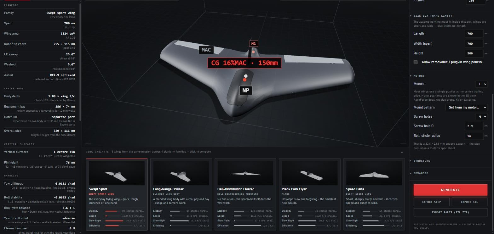
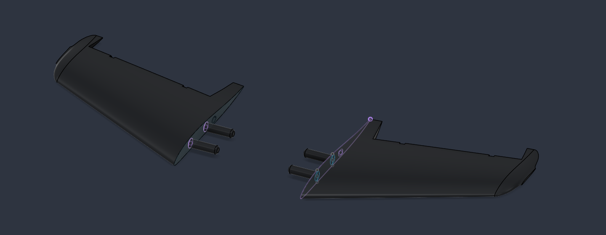
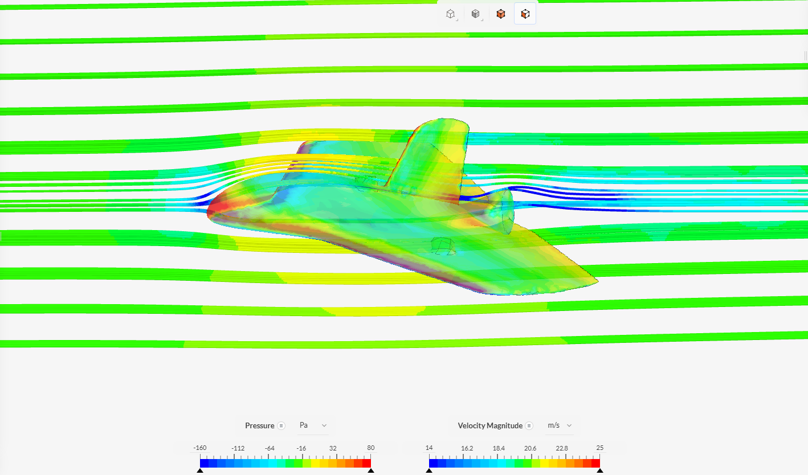
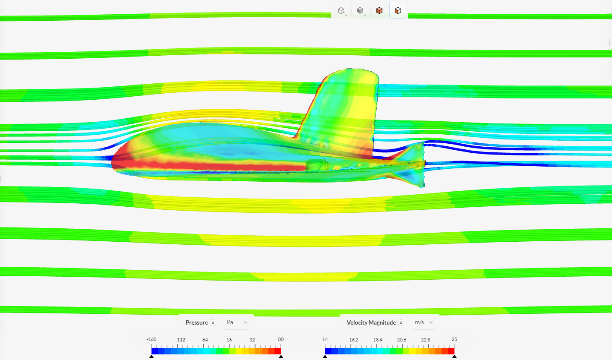
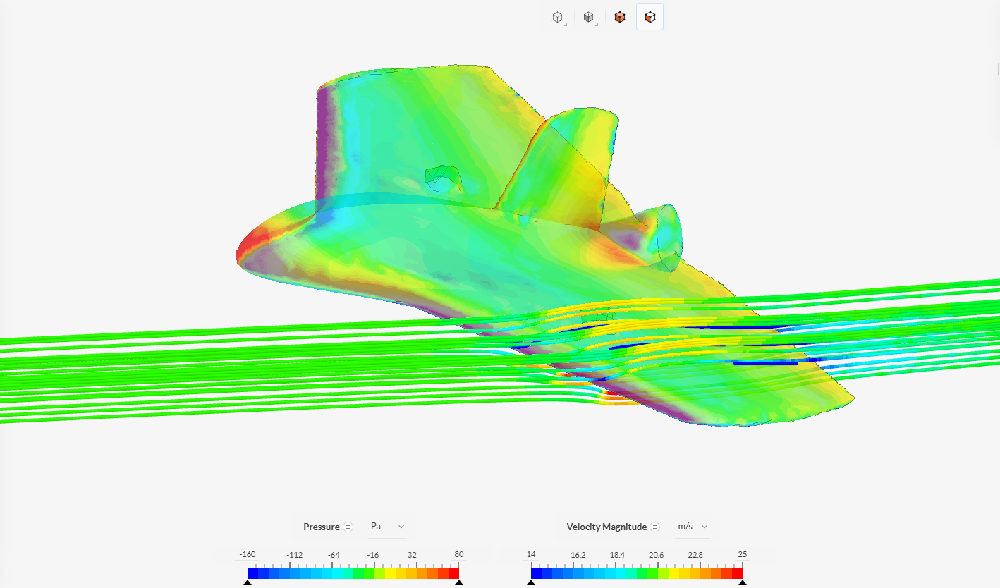
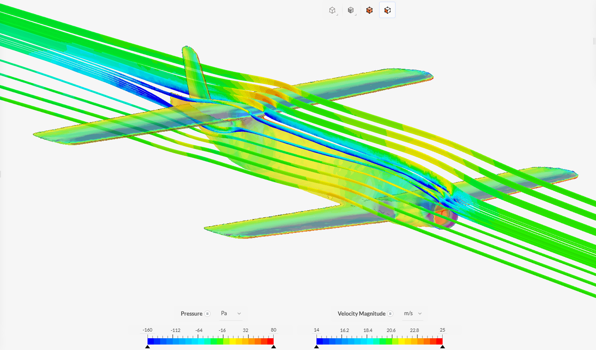
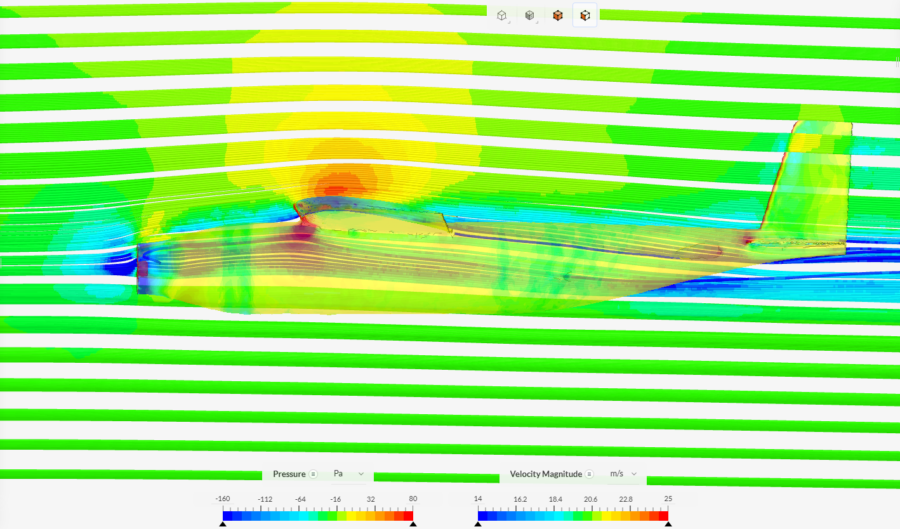

<p align="center">
  
</p>

<h1 align="center">AeroForge</h1>

<p align="center"><strong>A physics-based RC aircraft design studio that outputs print-ready hardware.</strong><br>
Give it an aircraft type, a mission, a cruise speed and a size box. It solves the coupled weight ↔ aerodynamics ↔ stability problem, hands you five genuinely different aircraft, renders them in 3D, and exports CAD with the servo pockets, wire runs, hinges, control horns and magnet hatch already in the part.</p>

<p align="center">
  <code>Python 3.12</code> · <code>FastAPI</code> · <code>CadQuery / OpenCASCADE</code> · <code>NeuralFoil</code> · <code>three.js</code> · <code>348 passed · 0 failed</code> (v3.1 gate, 2026-08-22) · validated in SimScale RANS · printed and flown
</p>

---

## Contents

- [What it is](#what-it-is)
- [The six aircraft types](#the-six-aircraft-types)
- [Hardware that comes out of the printer](#hardware-that-comes-out-of-the-printer)
- [Printed and flown](#printed-and-flown)
- [CFD validation](#cfd-validation)
- [Quick start](#quick-start)
- [How it works](#how-it-works)
- [Verification](#verification)
- [Project log and documentation](#project-log-and-documentation)
- [Known gaps](#known-gaps)
- [License](#license)

---

## What it is

Most RC design tools stop at a spreadsheet. AeroForge goes the other way: every number on screen is the output of a real calculation — ISA atmosphere, NeuralFoil polars at the Reynolds numbers RC models actually fly at, a spanwise strip model for the neutral point, tail-volume stability for tailed types — and the CAD it exports is the thing you slice and print, not a sketch of it.

**One request → five aircraft.** Each of the five is an independent constrained solve against a different planform family and different targets, so they differ in shape *and* behaviour. The gallery shows them side by side with normalized stability / speed / slow-flight / efficiency traits.

The physics and CAD decisions, the validation gates, the CFD runs and the flight test are the author's own, and `docs/ARCHITECTURE.md` and `aeroforge/DECISIONS.md` record which decision was made when and why.

**The CAD is the product.** One continuous watertight solid for the STL; a STEP assembly of named bodies for everything else. The centre body is hollow with a removable, magnet-retained hatch. Control surfaces are cut free and hung on print-in-place captive-pin hinges. Each servo pocket is the exact inverse of a measured SG90 with 0.25 mm per face. Every wire run is a Ø8.25 mm pipe with trumpeted mouths, starting at the servo's own lead grommet and ending inside the equipment bay. Every one of those cuts is existence-checked after the boolean, because OpenCASCADE will happily report success on an operation that did nothing.

---

## The six aircraft types

| Type | Layout | Reference airframes | Research basis |
|---|---|---|---|
| **Flying wing** | One continuous tip-to-tip loft; reflexed sections + washout; winglets, twin fins, centre fin or bell-spanload with *no* fins | Skywalker X5, AR Wing, Ritewing Drak, PW-51, NASA Prandtl-D | [`SPEC_FLYING_WING.md`](aeroforge/SPEC_FLYING_WING.md) |
| **Conventional** | Wing + superellipse fuselage + stab/fin; five styles (trainer / sport / aerobatic / floater / speed) | Flite Test Simple Cub, Eclipson Model A | [`RESEARCH_CONVENTIONAL.md`](aeroforge/RESEARCH_CONVENTIONAL.md) |
| **Delta** | Low-AR, 45–60° sweep, centre fin, elevons — rides the tailless machinery | Stryker class, paper-dart proportions | [`RESEARCH_TYPES_V3.md`](aeroforge/RESEARCH_TYPES_V3.md) §1 |
| **Canard** | Pusher pod, lifting foreplane that stalls first by construction, tip fins | Long-EZ class | §2 |
| **Tandem** | Two comparable wings, rear wing high, Quickie control split | Quickie class | §3 |
| **Twin-boom** | Pusher pod, two carbon-tube booms, H-tail between them | Skyhunter, MyTwinDream | §5 |

Four missions (`sport`, `fpv_cruiser`, `thermal_floater`, `park_flyer`) set the wing-loading band, stall margin and default cruise. An **"any"** mode competes every type's candidate set and returns the best five spanning at least three configurations.

Every band — sweep, taper, aspect ratio, tail volume, static margin, wing loading — is a cited row in the research dossiers, and the tests assert designs land inside them.

---

## Hardware that comes out of the printer

The hardware doctrine is identical across all six types. Every clearance carries its source; every cut is verified by point classification in the finished solid.

| Feature | Value | Where it came from |
|---|---|---|
| Servo pocket | exact inverse of the **SG90** model in `REAL SG90.stl`, **0.25 mm per face**, each feature its own vertical prism (case, lead stub, ears, gear head, spline) | the SG90 model was designed in CAD by the author from the physical part; the pocket's dimensions are triangle-exact slices of it, and the inverse is proven on all 1,614 vertices |
| Servo top slot | head-to-spline slot +1.5 mm; horn swing slot **25 mm** chordwise | builder test prints |
| Elevon / aileron hinge | **0.50 mm** hinge gap, **1.00 mm** spanwise end faces, captive pin **0.35 mm** radial | print-in-place practice, Bambu 0.4 mm profile |
| Control horn | rounded beveled triangle, ≤ 15 mm below skin, one plain **Ø2.5 mm** hole, rim ≥ 2.75 mm, set as far aft as the rake limit (50°) allows | four-bar solved per design; arm and horn share a plane by construction |
| Servo arm / horn radii | 11.0 / 11.0 mm — a parallelogram four-bar, ratio 1.000 | Model Aviation throw rule |
| Wire runs | every one **ONE straight oval pipe, 12.0 × 8.25 mm**, **constant cross-section** (no taper), starting *at* the lead grommet, ending inside the bay void — servo runs enter the bay wall at **90°, level**, arriving in a chamber that merges into the bay; the motor run may angle down, never bend | wire bundle + connector envelope; a straight rod passes end to end |
| Hatch magnets | **Ø8.15 mm** bores, cut exactly, zero added fit — four of them, two in the seat, two in the canopy | builder's spec; bores verified by classification |
| Hatch fit | lid 0.35 mm per side, seat 0.20 mm | printed-fit bands |
| Equipment bay | hollow, ceiling follows the crown, one wall (1.2 mm) of floor — thickened to ~3 mm automatically when the thin floor cannot be cut cleanly | hatch ladder |
| Motor mount | structural boss, screw holes drilled through boss + skin + bulkhead, bolt circle from the airframe mass | standard outrunner patterns |

A design that genuinely cannot carry a feature says so by name in its notes rather than shipping without it — that is the single most important rule in the codebase, and [`DECISIONS.md`](aeroforge/DECISIONS.md) records every time it earned its keep.

---

## Printed and flown

One AeroForge design has been through the whole loop: generated, printed in LW-PLA, and test-flown. It is a swept flying wing for the long-range FPV cruiser mission (cruise 18 m/s, 675 x 675 x 500 mm box, single centre fin, 4 x 3.2 mm motor mount on a 16 mm-radius bolt circle). [`deliverables/final.step`](deliverables/final.step) is the generator's verified output for that request and [`deliverables/My-Backtest.step`](deliverables/My-Backtest.step) is the design as built, after the author's own edits in Fusion. The one addition the code does not generate is the wing joint: two hand-added Ø14 x 40 mm joiner pegs on each wing panel's root face, glued into matching holes in the centre body.

<p align="center">
  <br>
  <sub>The flown design's wing panels in Fusion, with the hand-added joiner pegs</sub>
</p>

Flight results were not instrumented or logged; the repo records that it flew, not how well. The request body that reproduces `final.step` through the API is in [`deliverables/README.md`](deliverables/README.md).

---

## CFD validation

Three AeroForge-generated airframes were run as full 3D external-aerodynamics cases on SimScale — incompressible steady RANS, k-ω SST, 20 m/s, 1:1 scale. The colour ranges below are pinned by hand to **−160 → +80 Pa** surface pressure and **14 → 25 m/s** velocity, so suction reads blue, stagnation red, and ambient sits mid-scale.

<p align="center">
  <br>
  <sub><b>Flying wing</b> — streamlines seeded on the frontal section, surface coloured by pressure, 20 m/s</sub>
</p>

<table>
  <tr>
    <td width="50%"><br><sub><b>Flying wing</b> — streamlines through the centre body and over the tip fin</sub></td>
    <td width="50%"><br><sub><b>Flying wing</b> — the rake seeded on one wing's frontal section</sub></td>
  </tr>
  <tr>
    <td><br><sub><b>Tandem</b> — the rear wing riding clear of the front wing's wake</sub></td>
    <td><br><sub><b>Conventional</b> — suction peak over the wing, tailplane in clean air</sub></td>
  </tr>
</table>

### Results at 0° to the STL datum

| Airframe | Lift (N) | Drag (N) | Side (N) | L/D | Viscous share of drag |
|---|---|---|---|---|---|
| Conventional | **+8.882** | **1.222** | 0.015 | **7.27** | 25 % |
| Tandem wing | **+11.086** | **1.666** | 0.004 | **6.65** | 28 % |
| Flying wing | **−3.400** | **0.966** | 0.018 | — | 33 % |

Side force is ≈ 0 on all three (symmetric geometry, symmetric solution), stagnation pressure peaks at Cp ≈ 1.0, and the flying wing's higher viscous share is what an all-wing layout should show. The flying wing's negative lift is real and expected: its reflexed sections put the zero-lift line *above* the STL datum, so at 0° it makes downforce and trims at a positive angle — the three are therefore not directly comparable at a single datum angle, and an angle-of-attack sweep is the open item.

Full conditions, mesh preparation notes, convergence plots and the live (browser-openable) SimScale projects are in [`CFD_results/README.md`](CFD_results/README.md).

---

## Quick start

Python 3.11 or 3.12 exactly: cadquery/OCP publish wheels for those two only (no 3.13), for Windows, Linux and macOS (Intel and Apple Silicon). The first install downloads about 500 MB of wheels.

**Windows 10/11**

```
cd aeroforge
run.bat
```

**macOS / Linux**

```
brew install python@3.12          # macOS, once
cd aeroforge
chmod +x run.sh && ./run.sh
# stop:  kill $(cat .server.pid)
```

Either launcher creates the virtual environment, installs dependencies (first run only), starts the server and opens `http://127.0.0.1:8000`. Or by hand (`.venv\Scripts\python.exe` on Windows, `.venv/bin/python` on macOS/Linux; the docs use the Windows form):

```
cd aeroforge
python3.12 -m venv .venv
.venv/bin/python -m pip install -r requirements.txt
.venv/bin/python -m uvicorn backend.main:app --host 127.0.0.1 --port 8000
.venv/bin/python -m pytest tests/test_type_dispatch.py -q     # 5 s smoke test, builds no CAD
```

There is no Windows-only code path: CAD workers use `multiprocessing` spawn, paths go through `pathlib`, and `tools_cadlock.py` is a plain file lock.

What to expect on the clock: physics for five variants returns in about two seconds, but each 3D preview is a full CadQuery build, roughly 140 to 170 s per solid, so all five previews take about 11 to 12 minutes on the two-worker pool (measured in [`aeroforge/docs/PERF_NOTES.md`](aeroforge/docs/PERF_NOTES.md)). A full STEP export took 8 to 35 minutes depending on machine load on the 4-core laptop the project was built on (from the 2026-08-28 notes). Run one CAD build at a time; two thrash memory. `aeroforge/exports/` is a git-ignored cache that grows to gigabytes.

Pick a type, a mission, a cruise speed and a box → **Generate**. Five aircraft appear in the gallery; the primary one renders part-by-part in the viewer (fixed structure, moving surfaces and the hatch in distinct greys, CG / neutral point / MAC / motors overlaid). **Export STEP**, **Export STL** or **Export parts** writes to `aeroforge/exports/`.

Previews start building in the background the moment you generate, so by the time you have read the spec sheet the 3D view is usually already there.

Two directories at the repo root are not part of the app: `deliverables/` holds the exported STEP files of the design that was printed and flown (see above), and `My-Designs/` holds two small STLs of the author's own (`USBC-Speedy.stl`, `GPS-Speedy.stl`, 17 KB and 5 KB) added with v3.1; the repo does not record what they are for. `CFD_STLs/` holds the three airframes the wind-tunnel study was run on.

---

## How it works

```
frontend (three.js)  ──POST /api/generate──▶  physics/variants.py
                                                    │  five optimize_* solves, one per character
                                                    ▼
                                              design dicts (JSON) ──▶ gallery, spec sheet, design notes
                                                    │
        GET /api/preview/{id}/parts.json ◀──────────┘  lazy + eagerly warmed
                                                    │
                                              cadjobs worker pool (2 × spawn)
                                                    │
                                              cad/geometry.py  ──dispatch table──▶  cad/conventional.py
                                                                                    cad/multiwing.py (canard, tandem)
                                                                                    cad/twinboom.py
                                                                                    tailless path (flying wing, delta)
                                                    │
                                              hinges · servos · conduits · hatch  (shared hardware modules)
                                                    │
                                              STL (one watertight solid) · STEP (named assembly) · parts zip
```

- **Physics** (`aeroforge/backend/physics/`) — ISA + Sutherland, analytic reflexed and NACA sections with NeuralFoil polars, lift / drag build-up / stall, a spanwise strip model for tailless NP and trim washout, tail-volume stability with a Munk fuselage term for tailed types, handling on all three axes, areal-density weights, and a constrained sweep + Nelder-Mead optimizer minimising specific drag. Every equation cites the relation it implements.
- **CAD** (`aeroforge/backend/cad/`) — multi-section lofts healed with ShapeFix after every boolean; a dispatch *table* (not an if-chain) that tests assert cannot drift from the type registry; every cut and fuse verified geometrically in the result.
- **Server** (`aeroforge/backend/`) — FastAPI; CAD runs in worker processes because OpenCASCADE holds the GIL; artifacts are content-addressed and cached immutably; JSON is gzipped, binary artifacts are not.

---

## Verification

The test suite builds real aircraft. A full run is several hours of CAD; it is the gate every change in the log below passed. Release gate for v3.1 (2026-08-22): **348 passed, 5 skipped, 0 failed** on cold caches (10 h 06 min wall on a 4-core laptop), plus a 56-request generation sweep with zero exceptions. The 21 commits since v3.1 (straight wire runs, the rear cavity as the hull itself, the overnight fin and motor-entry fixes) were gated on the light suites and on targeted `-k` selections of the CAD suites; the full CAD suites (`test_cad_export.py`, `test_conventional.py`, `test_api.py`, about 45 min) were not re-run in full after the last of them, so the 348 figure is the v3.1 number, not a current one.

| Suite | What it proves |
|---|---|
| `test_optimizer`, `test_conventional_physics`, `test_multiwing_physics`, `test_boomglider_physics` | every band lands where the research says; CG ahead of NP; L = W; stall margin; five variants spanning ≥ 3 families; the servo-fit chord floor |
| `test_cad_export` (4 planforms), `test_conventional`, `test_multiwing`, `test_twinboom`, `test_delta_cad` | exactly one valid watertight solid; nothing ahead of the nose datum; bbox inside the recorded envelope; mesh ≥ 98.5 % of BRep area; hollow bay with a separable lid **and an intact floor**; hinged surfaces on captive pins; horn bores proven open; servo pipes at the grommet; motor bores proven; fins proven present |
| `test_type_dispatch` | every registered type reaches the CAD module that owns it |
| `test_api` | every endpoint, lazy previews, concurrent preview requests, exports through the worker pool |

Beyond the suite, three probe audits run in seconds against the same host models the builders use and are recorded in `DECISIONS.md`: tail-surface continuity on every conventional style × tail type, servo-pocket fit across every twin-boom style × box, and belly integrity down the bay centreline of the built part.

---

## Project log and documentation

| Document | What it is |
|---|---|
| [`CHANGELOG.md`](CHANGELOG.md) | Dated release log, July → August 2026 |
| [`aeroforge/DECISIONS.md`](aeroforge/DECISIONS.md) | Every design decision, bug found, and the evidence behind it — the engineering notebook |
| [`aeroforge/SPEC_FLYING_WING.md`](aeroforge/SPEC_FLYING_WING.md) | Binding contract for the flying-wing domain model, schema, CAD topology and invariants |
| [`aeroforge/RESEARCH_CONVENTIONAL.md`](aeroforge/RESEARCH_CONVENTIONAL.md) · [`RESEARCH_TYPES_V3.md`](aeroforge/RESEARCH_TYPES_V3.md) | The cited-band dossiers behind every number |
| [`aeroforge/VALIDATION.md`](aeroforge/VALIDATION.md) | Auto-generated physics audit from real optimizer runs |
| [`aeroforge/docs/PERF_NOTES.md`](aeroforge/docs/PERF_NOTES.md) | The performance pass, with the byte-identity proof |
| [`aeroforge/docs/V2_PLAN.md`](aeroforge/docs/V2_PLAN.md) · [`V3_PLAN.md`](aeroforge/docs/V3_PLAN.md) | Working contracts for the multi-type architecture |
| [`CFD_results/README.md`](CFD_results/README.md) | The wind-tunnel study |
| [`docs/ARCHITECTURE.md`](docs/ARCHITECTURE.md) | The most compact statement of the invariants and hardware doctrine; read it before editing anything |
| [`aeroforge/CODE_MAP.md`](aeroforge/CODE_MAP.md) | Module-by-module map: where to edit for what, and which test or tool proves each claim |
| [`deliverables/README.md`](deliverables/README.md) | The printed-and-flown design and the API request that reproduces it |

---

## Known gaps

Recorded honestly rather than hidden; each is an open decision.

- **Configuration axes are advertised but unwired.** The tail-type (conventional / T / V), wing-position and motor-layout selects in the UI are accepted and silently ignored for `conventional` and `twin_boom`; the transforms exist in `physics/config_axes.py` and were only ever consumed by the since-removed glider type.
- **The CFD is a single angle of attack.** A sweep is needed before the three airframes can be compared on L/D.
- **`sport` twin-boom at the smallest boxes** cannot bury its aileron servo at the researched aspect-ratio floor and says so (`geometry.servo_chord_floor.fits = false`) rather than shipping a pocket that will not seat.
- **Delta ships a reduced equipment bay.** The hatch ladder settles on rung 4 (about 62 % of the bay width): rung 0 is rejected by the canopy underside cut, rungs 1 to 3 by the airframe mesh gate. Open since 2026-08-28.
- **Canard and tandem have no feasible primary at their own recommended box.** They bind on servo fit or nose-to-fin length; the API returns HTTP 200 with `feasible: false` and the binding constraint, and the UI shows the closest feasible design.
- **Informational warnings surface as refusals.** `cadjobs.build_refusals` lists `warnings` (for example the twin-boom's "batched build rejected; rebuilding one hinge at a time") in the same banner as real refusals.
- **The BREP cache for parts is bypassed.** Its output was not byte-identical to a direct build (the STEP body and the wing/elevon part STLs differed), so `cadjobs._parts_for` skips it; the one-piece solid cache is proven identical and stays on. Parts exports are therefore slower than they could be.
- **Some type × mission × box combinations are physically infeasible and are reported as such**, not hidden. A release sweep of every type × every mission × two boxes (56 requests) produced zero exceptions and five variants every time; the variants that come back `feasible = false` do so for named reasons: canards at the 11 m/s floater / park-flyer missions bind on the Reynolds floor (foreplane Re 57–87k against the 90k hard floor), tandems in a 700 mm box bind on box length, and a handful of characters miss the park-flyer stall margin by 0.02–0.07. The UI shows the closest feasible design with the binding constraint in the banner.

---

## License

MIT — see [`LICENSE`](LICENSE). `REAL SG90.stl`, the servo model the pockets are cut from, is the author's own CAD work and is covered by the same license.
